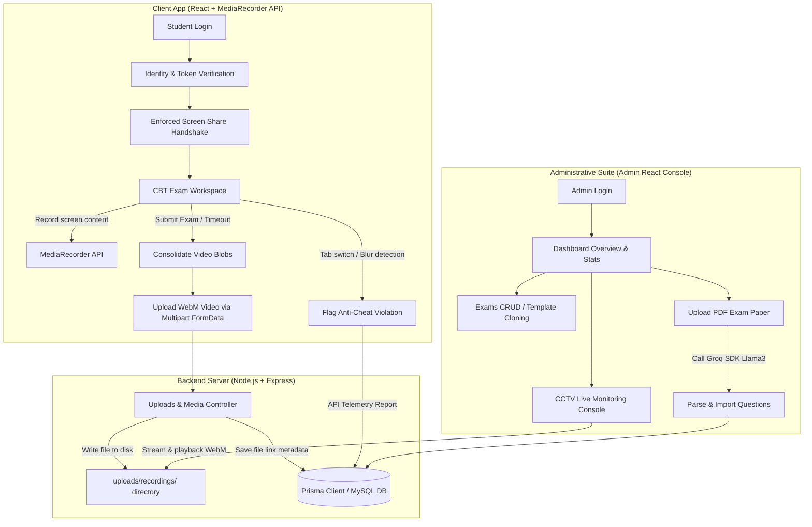

<p align="center">
  
</p>

<p align="center">
  <a href="https://github.com/ksisiksksks/cbtpro">
    
  </a>
  <a href="https://github.com/ksisiksksks/cbtpro/blob/main/LICENSE">
    
  </a>
  <a href="https://github.com/ksisiksksks/cbtpro/actions">
    
  </a>
  
  
  
  
</p>

<p align="center">
  <strong>CBTPro</strong> is an open-source, enterprise-grade admission system coupled with a state-of-the-art Computer Based Testing (CBT) platform. Empowered by real-time proctoring telemetry, automated screen-recording tracking, and AI-assisted exam generation, CBTPro establishes a high-integrity virtual testing environment.
</p>

> [!WARNING]
> ### 🛑 STRICT ANTI-RESALE & NON-COMMERCIAL POLICY
> **CBTPro is 100% Open-Source and free to use for personal, educational, and institutional testing purposes.**
> * **Free for All:** You are fully allowed to self-host, modify, and distribute this platform to run student admissions for free.
> * **NO RESALE:** You are **STRICTLY FORBIDDEN** from selling, reselling, renting, leasing, or direct commercial monetization of this software, its source code, or any modified derivative versions. Do not buy or sell this project!

---

## 🎬 Live Interactive Demo

Witness **CBTPro** in action! Below is a live walkthrough of the platform demonstrating:
1. Public candidate portal and registration flows.
2. Secure administrative authentication.
3. Reviewing candidate verification documents.
4. Structuring rich-text multiple-choice exams.
5. Accessing candidate telemetry alerts and playing back proctored screen-share recording files.

<p align="center">
  
</p>

---

## 🗺️ Table of Contents
1. [Live Interactive Demo](#-live-interactive-demo)
2. [System Architecture & Workflow](#-system-architecture--workflow)
3. [Interface Showcases](#-interface-showcases)
4. [Key Architectural Capabilities](#-key-architectural-capabilities)
5. [Prisma Database Schema Definitions](#-prisma-database-schema-definitions)
6. [Rest API Reference Guide](#-rest-api-reference-guide)
7. [Directory Structure](#-directory-structure)
8. [Environment Configurations](#-environment-configurations)
9. [Setup & Installation Instructions](#-setup--installation-instructions)
10. [Proctoring Telemetry Details](#-proctoring-telemetry-details)
11. [Troubleshooting & FAQ](#-troubleshooting--faq)
12. [Project Roadmap](#-project-roadmap)
13. [Contributing & License](#-contributing--license)

---

## 🖥️ System Architecture & Workflow

Here is how the telemetry logs, screen recording files, and anti-cheat modules interact between client, server, database, and AI SDKs:



---

## 📺 Interface Showcases

<table width="100%">
  <tr>
    <td width="50%" align="center"><strong>🌐 Public Candidate Portal</strong></td>
    <td width="50%" align="center"><strong>🔒 Admin Authentication Gate</strong></td>
  </tr>
  <tr>
    <td></td>
    <td></td>
  </tr>
  <tr>
    <td width="50%" align="center"><strong>📈 Statistics & Real-time Overview</strong></td>
    <td width="50%" align="center"><strong>✏️ Rich-Text Exam Editor & Template Duplicator</strong></td>
  </tr>
  <tr>
    <td></td>
    <td></td>
  </tr>
  <tr>
     <td colspan="2" align="center"><strong>🎥 Live Telemetry & Automated Video Proctoring Playback</strong></td>
  </tr>
  <tr>
     <td colspan="2" align="center"></td>
  </tr>
</table>

---

## 🚀 Key Architectural Capabilities

* **Telemetry Proctoring:** Enforced full-screen share handshakes, visibility state observers (`visibilitychange`), and keyboard blockings (right-clicks, copy, paste).
* **Media Archiving:** Real-time screen-frame capture via `MediaRecorder` API uploaded automatically as `.webm` chunks to avoid client memory exhaustion.
* **Question Blueprinting:** Integrated Rich Text Editor (RTE) `react-quill` storing safe HTML structures inside MySQL database JSON columns.
* **Instant Cloner:** One-click structural copy endpoints duplicating exam configurations and option groups.
* **AI Ingestion:** Local PDF text parsers backed by **Groq Cloud API (Llama 3)** for automated question/answer classification.

---

## 📊 Prisma Database Schema Definitions

The application leverages a highly normalized MySQL database structure managed by Prisma ORM:

| Model | Description | Crucial Fields | Relations |
| :--- | :--- | :--- | :--- |
| **User** | Core auth entity managing credentials and security roles. | `email`, `password`, `role` (ADMIN, STUDENT) | Relates to **Student** (1-to-1) |
| **Student** | Candidate profile detailing enrollment info and documents. | `fullName`, `nisn`, `phone`, `status` (PENDING, VERIFIED) | Has many **Documents**, **ExamResults**, **ExamSessions** |
| **Document** | Identity validation files uploaded by candidates. | `fileName`, `fileUrl`, `type` | Belongs to **Student** |
| **Exam** | Exam modules detailing rules and scheduling bounds. | `title`, `durationMinutes`, `startTime`, `endTime` | Has many **Questions**, **ExamResults**, **ExamSessions** |
| **Question** | Individual test items including text and multiple options. | `text` (HTML Text), `options` (JSON Array), `correctOption` | Belongs to **Exam** |
| **ExamSession** | Tracks live CBT progression, active status, warnings, and videos. | `status` (ONGOING, SUBMITTED), `cheatWarnings`, `recordingUrl` | Relates to **Student** and **Exam** |
| **ExamResult** | Final compiled test scores generated upon exam submission. | `score` | Relates to **Student** and **Exam** |

---

## 🔌 Rest API Reference Guide

### 1. Authentication Route
* **`POST /api/auth/register`**
  * *Access:* Public (Student signup)
  * *Body:* `{ email, password, fullName, nisn }`
* **`POST /api/auth/login`**
  * *Access:* Public (Authenticates admin/students)
  * *Body:* `{ email, password }`

### 2. Admin Panels Control
* **`GET /api/admin/exams`**
  * *Access:* Authenticated Admin
  * *Description:* Retrieves all exams with question counts.
* **`POST /api/admin/exams`**
  * *Access:* Authenticated Admin
  * *Body:* `{ title, description, durationMinutes, startTime, endTime }`
* **`POST /api/admin/exams/clone/:id`**
  * *Access:* Authenticated Admin
  * *Description:* Duplicates the target exam and copies all its questions into a new set.
* **`POST /api/admin/exams/:examId/questions`**
  * *Access:* Authenticated Admin
  * *Body:* `{ text, options, correctOption }` (stores parsed JSON arrays)
* **`DELETE /api/admin/database/clear/results`**
  * *Access:* Authenticated Admin
  * *Description:* Clears all sessions, warnings, and scores (Clean DB).

### 3. Student CBT Telemetry
* **`GET /api/exams/latest`**
  * *Access:* Authenticated Student
  * *Description:* Fetches the active exam assigned to the verified student.
* **`POST /api/exams/start`**
  * *Access:* Authenticated Student
  * *Description:* Initiates an exam session and sets start timestamp.
* **`POST /api/exams/cheat`**
  * *Access:* Authenticated Student
  * *Description:* Tracks background tab-switches and increments `cheatWarnings`.
* **`POST /api/exams/upload-recording`**
  * *Access:* Authenticated Student
  * *Description:* Uploads the proctoring screen-recording `.webm` file (Multipart/form-data).
* **`POST /api/exams/submit`**
  * *Access:* Authenticated Student
  * *Body:* `{ examId, answers: { questionId: chosenOptionLetter } }`

---

## 📦 Directory Structure

```
/coding
├── .github/workflows/  # CI pipelines (CI build check workflows)
│   └── ci.yml
├── backend/            # Express.js + TypeScript Backend Server
│   ├── prisma/         # Prisma Schemas & Database Migration Scripts
│   ├── src/
│   │   ├── controllers/# Business Controllers (Auth, Student, Exam, Proctoring)
│   │   ├── middlewares/# JWT Security Checkers
│   │   └── utils/      # Wrappers (Prisma client, Groq config)
│   └── uploads/        # Host folder for proctor recordings (.webm video files)
├── frontend/           # Vite + React Client Dashboard
│   └── src/
│       ├── components/ # Reusable UI components
│       └── pages/      # View routes (CbtExam, AdminDashboard, etc.)
└── screenshots/        # Assets and visual elements for README.md
```

---

## 📝 Environment Configurations

Before launching, configure a `.env` in the `backend/` root directory using the definitions below:

```properties
# Backend port configuration
PORT=5000

# Prisma MySQL driver connection string
DATABASE_URL="mysql://root:@localhost:3306/spmb_db"

# JWT token signing secret key
JWT_SECRET="YOUR_RANDOM_LONG_SECRET_KEY"

# Groq API cloud key for AI question extraction
GROQ_API_KEY="YOUR_GROQ_CLOUD_API_KEY"
```

---

## ⚙️ Setup & Installation Instructions

<details>
<summary><b>🔌 Setup Backend API Server</b></summary>

1. Navigate to the backend directory:
   ```bash
   cd backend
   ```
2. Install NodeJS dependencies:
   ```bash
   npm install
   ```
3. Set up database variables. Rename or create a `.env` file inside `backend/` directory:
   ```env
   PORT=5000
   DATABASE_URL="mysql://root:@localhost:3306/spmb_db"
   JWT_SECRET="YOUR_RANDOM_LONG_SECRET_KEY"
   GROQ_API_KEY="YOUR_GROQ_CLOUD_API_KEY"
   ```
4. Perform Prisma migration checks to compile drivers:
   ```bash
   npx prisma db push
   ```
5. Seed initial mock database exams and questions:
   ```bash
   npx ts-node seed.ts
   ```
6. Start dev server:
   ```bash
   npm run dev
   ```
</details>

<details>
<summary><b>🎨 Setup Frontend React App</b></summary>

1. Navigate to the frontend directory:
   ```bash
   cd ../frontend
   ```
2. Install frontend packages:
   ```bash
   npm install
   ```
3. Start the dev client:
   ```bash
   npm run dev
   ```
4. Open your browser and view client portal: `http://localhost:5173`.
</details>

---

## 🔒 Proctoring Telemetry Details

The security system runs on dual layers of protection:

### 1. Tab switching/blur handler:
```javascript
// Observers tab visibility and logs to backend
document.addEventListener('visibilitychange', () => {
  if (document.hidden) {
    // Increments violation metrics automatically
    axios.post('/api/exams/cheat', { examId });
  }
});
```

### 2. Stream recorder & chunks packaging:
```javascript
// Sets stream constraints and pipe chunks
const stream = await navigator.mediaDevices.getDisplayMedia({ video: true });
const mediaRecorder = new MediaRecorder(stream, { mimeType: 'video/webm' });
mediaRecorder.ondataavailable = (e) => {
  if (e.data.size > 0) recordedChunks.push(e.data);
};
```

---

## 🛠️ Troubleshooting & FAQ

#### Q: I receive a `P1001: Can't reach database server` error. How do I fix it?
Make sure your MySQL database service is running locally on port 3306. Check your database username/password matching credentials in `backend/.env`.

#### Q: How do I grant screen-recording permissions?
If your browser throws `NotAllowedError: Permission denied`, check your operating system preferences (System Settings -> Privacy & Security -> Screen Recording) and allow Chrome/Firefox/Safari browser access.

#### Q: Why is my PDF AI upload failing?
Make sure `GROQ_API_KEY` is active and correct. The PDF must contain extractable text characters (not a flat-scanned photograph).

---

## 🗺️ Project Roadmap
- [ ] **Proctor Multi-Camera Monitor:** Enable secondary webcam recording using Face-Mesh checks.
- [ ] **Offline Standalone Lock:** Develop a lightweight electron wrapper app to lock system functions entirely.
- [ ] **AI-Assisted Grading Analyser:** Automated grading analytics and feedback generation for essays.

---

## 🤝 Contributing & License
* Contributions are welcome! Please check out [CONTRIBUTING.md](./CONTRIBUTING.md).
* This project is open-source software licensed under the **[CBTPro Non-Commercial License](./LICENSE)**.
